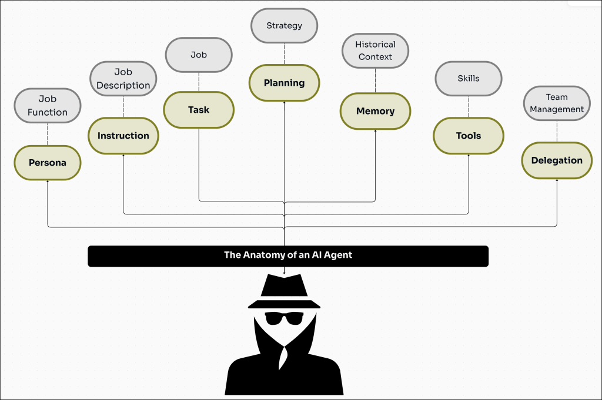

# Agent Framework 🤖

Agent Framework is a Python framework for building capable, context-aware AI agents. It provides a flexible foundation for creating AI agents with distinct personas, managed instructions, conversational memory, and strategic planning capabilities.



## Features ✨

- **🎭 Persona Management**: Define distinct personalities and roles for your agents
- **📝 Instruction & Task Control**: Implement clear operational guidelines and task execution
- **🧠 Conversational Memory**: Maintain context across interactions 
- **🎯 Strategic Planning**: Enable agents to break down complex tasks based on reasoning
- **💾 State Persistence**: Save and restore agent states 
- **📚 Context Management**: Handle and maintain relevant contextual information based on RAG 
- **🔧 Tool Integration**: Extend agent capabilities through custom tools 

## Getting Started

Follow these steps to try out the workflow:

1. Create a virtual environment:
   ```bash
   python -m venv venv
   ```

2. Activate the virtual environment:
   ```bash
   source venv/bin/activate
   ```

3. Install dependencies:
   ```bash
   pip install -r requirements.txt
   ```

4. Navigate to desired step:
   ```bash
   cd <step>
   ```

5. Run the flow:
   ```bash
   python flow.py
   ```

## Framework Steps

The framework is organized into progressive steps, each building upon the previous one:

### [step-1-persona](./step-1-persona)
Introduces basic agent creation with persona management. Learn how to define and implement distinct personalities and behavioral traits for your agents.

### [step-2-stmemory](./step-2-stmemory)
Implements short-term memory capabilities, allowing agents to maintain context and remember previous interactions within a conversation.

### [step-3-reasoning](./step-3-reasoning)
Adds strategic planning and reasoning capabilities, enabling agents to break down complex tasks and make informed decisions.

### [step-4-persistence](./step-4-persistence)
Demonstrates state persistence functionality, allowing agents to save and restore their state across different sessions.

### [step-5-context](./step-5-context)
Introduces context management using RAG (Retrieval-Augmented Generation) for more informed and contextually aware responses.

### [step-6-tools](./step-6-tools)
Showcases tool integration capabilities, allowing agents to interact with external tools and APIs to extend their functionality.

## Notes

- Make sure you have Python installed on your system
- Replace `<step>` with the actual directory name you want to explore
- The virtual environment needs to be activated every time you open a new terminal session
- Each directory represents a progressive step in the framework, with each subsequent step building upon the functionality of the previous ones

## Directory Structure

Each directory contains its own examples and documentation to help you understand and implement the specific functionality it introduces. Navigate to each step sequentially to build a complete understanding of the framework's capabilities.